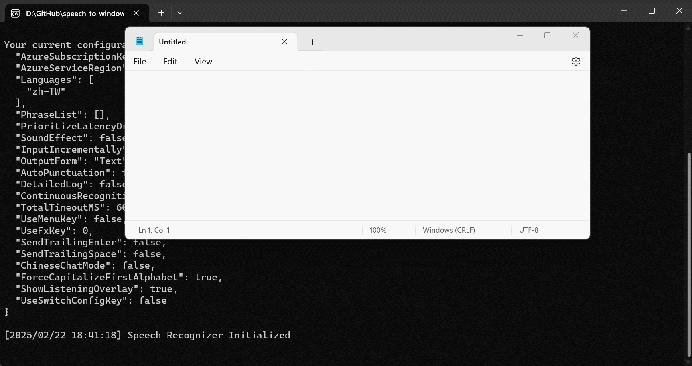

# Speech to Windows Input (STWI)

## How to Use

Prerequisites:
- .Net Framework >= 4.6.1
- [Microsoft Visual C++ Redistributable Package](https://docs.microsoft.com/en-US/cpp/windows/latest-supported-vc-redist?view=msvc-170#visual-studio-2015-2017-2019-and-2022) (required by the [Azure Speech SDK](https://github.com/Azure-Samples/cognitive-services-speech-sdk/tree/master/samples/csharp/dotnetcore/console))
- An Azure subscription key for the Speech service. See [Try the speech service for free](https://docs.microsoft.com/en-us/azure/cognitive-services/speech-service/overview#try-the-speech-service-for-free).
- A Windows PC with a working microphone.

Download the executable in [the release page](https://github.com/j3soon/speech-to-windows-input/releases).

Copy the Azure key and region text into the config file `config.json`.

Launch the program and press `Alt+H` to start speech recognition.

## Demo GIFs




Note: If your current input language is set to Chinese, you can select characters after performing speech recognition.

## Configuration File

```json
{
  "AzureSubscriptionKey": "<paste-your-subscription-key>",
  "AzureServiceRegion": "<paste-your-region>",
  "Languages": [
    "en-US",
    "zh-TW"
  ],
  "PhraseList": [],
  "PrioritizeLatencyOrAccuracy": "Latency",
  "SoundEffect": false,
  "InputIncrementally": true,
  "OutputForm": "Text",
  "AutoPunctuation": true,
  "DetailedLog": false,
  "ContinuousRecognition": false,
  "TotalTimeoutMS": 60000,
  "UseMenuKey": false,
  "SendTrailingEnter": false,
  "SendTrailingSpace": false,
  "ShowListeningOverlay": true
}
```

Make sure to replace `<paste-your-subscription-key>` and `<paste-your-region>` to valid Azure credentials, otherwise, an error will be raised.

- `AzureSubscriptionKey`: Your Azure subscription key.
- `AzureServiceRegion`: Your Azure subscription region. (e.g., `"westus"` or `"eastasia"`)
- `Languages`: A list of languages to perform speech recognition. (No mixed language recognition) See the [supported languages](https://docs.microsoft.com/en-us/azure/cognitive-services/speech-service/language-support#speech-to-text) for more information. If the list only contains a single language, the recognition performance will be much faster since no auto language detection is performed.
- `PhraseList`: A list of of custom phrases such as names, technical terms, etc. For an example, if you are a gamer that types `GG` (i.e., Good Game) a lot, you will want to add `GG` in this list. Otherwise, Azure will recognize it as `JuJu`, `Gigi`, etc.
- `PrioritizeLatencyOrAccuracy`: Select the recognition mode between `"Latency"` and `"Accuracy"`.
- `SoundEffect`: Determines whether the program should play a hint sound when the speech recognition starts/stops.
- `InputIncrementally`: Determines whether the program should input incrementally (revise with backspace along the way), or simply input once when the recognition result is confirmed.
- `OutputForm`: Select the recognition output, can be `"Text"`, `"Lexical"`, or `"Normalized"`. See the [output form details](https://docs.microsoft.com/en-us/dotnet/api/microsoft.cognitiveservices.speech.detailedspeechrecognitionresult?view=azure-dotnet) for more information.
- `AutoPunctuation`: Determines whether to automatically insert punctuation.
- `DetailedLog`: Determines whether to log confidence, recognized words, and other recognition details.
- `ContinuousRecognition`: Determines whether to use continuous recognition, which requires user to manually stop the on-going recognition.
- `TotalTimeoutMS`: When continuous recognition is enabled, the recognition will be stopped after the specified amount of milliseconds, to avoid user forgetting to stop the on-going recognition.
- `UseMenuKey`: Determines whether the [menu/application key](https://en.wikipedia.org/wiki/Menu_key) (`≣ Menu`) can be used as `Alt+H`. (Make the key acts like a dedicated speech recognition key)
- `SendTrailingEnter`: Determines whether to send a trailing `enter` after sending inputs.
- `SendTrailingSpace`: Determines whether to send a trailing `space` after sending inputs.
- `ShowListeningOverlay`: Determines whether to show an indicator microphone overlay window when the program is listening.

## Program Hint

```
speech-to-windows-input (made by j3soon)
1. Press Alt+H to convert speech to text input. The recognition stops on (1) microphone silence (2) after 15 seconds (3) Alt+H is pressed again.
2. Press ESC to cancel the on-going speech recognition (no input will be generated).
3. Press Ctrl+C to exit.
Notes:
- The default microphone & internet connection is used for speech recognition.
- If input fails for certain applications, you may need to launch this program with `Run as administrator`.
- The initial recognition delay is for detecting the language used. You can modify the language list to contain only a single language to speed up the process.
```

## Side Notes

Runtime:
- If Unicode characters (e.g., Chinese) cannot be shown correctly, you should set the console font to support Unicode.
- If you don't want your credit card be accidentally charged, set the Pricing Tier to `Free F0` instead of `Standard F0` (Pay as You Go). The free tier has [5 hours audio quota each month](https://azure.microsoft.com/en-us/pricing/details/cognitive-services/speech-services/), and will not charge you when exceeding the quota limit.

Compilation:
- Azure Speech service does not support `AnyCPU`, use `x86`/`x64` instead.

## Features:

(✔️ means implemented, ❌ means not)
- ✔️ [Automatic language detection](https://docs.microsoft.com/en-us/azure/cognitive-services/speech-service/how-to-automatic-language-detection?pivots=programming-language-csharp)
  Pre-define a list of languages. Azure Speech SDK will identify the languages used before starting speech recognition. (i.e., Language Detection -> Speech Recognition for that specific language). Speech recognition for mixed languages is not supported at the time of writing.
- ✔️ [Recognizing custom phrases](https://docs.microsoft.com/en-us/dotnet/api/microsoft.cognitiveservices.speech.phraselistgrammar?view=azure-dotnet)
  Allows recognition of custom phrases such as names, technical terms, etc.
- ✔️ [Detailed results](https://docs.microsoft.com/en-us/dotnet/api/microsoft.cognitiveservices.speech.detailedspeechrecognitionresult?view=azure-dotnet), [[sample1]](https://github.com/Azure-Samples/cognitive-services-speech-sdk/issues/667), [[sample2]](https://stackoverflow.com/a/51190072)
  Reports the recognition confidence, and the actual words recognized.
- ✔️ [Continuous recognition](https://docs.microsoft.com/en-us/azure/cognitive-services/speech-service/get-started-speech-to-text?tabs=windowsinstall&pivots=programming-language-csharp#continuous-recognition)
  Instead of performing speech recognition until silence or reaching 15 seconds, let user choose when to stop the recognition.
- ❌ Add an GUI option instead of solely rely on hotkeys
- ❌ [Select an audio input device](https://docs.microsoft.com/en-us/azure/cognitive-services/speech-service/how-to-select-audio-input-devices)
  Instead of the default microphone, let the user choose the preferred microphone.

## References

Minimal Sample:
- [Quickstart: Recognize speech from a microphone in C# under .NET Framework for Windows](https://github.com/Azure-Samples/cognitive-services-speech-sdk/tree/master/quickstart/csharp/dotnet/from-microphone)
- [Get started with speech-to-text](https://docs.microsoft.com/en-us/azure/cognitive-services/speech-service/get-started-speech-to-text?pivots=programming-language-csharp&tabs=windowsinstall)
